## 하나증권 : THE NEXT 프로젝트의 저장소를 방문해주셔서 감사합니다!

> 안녕하세요! 하나증권 : THE NEXT 프로젝트 저장소에 오신 것을 환영합니다.
>
> 프로젝트 광고 영상은 아래 [프로젝트 소개](#1-프로젝트-소개)에서 확인하실 수 있으며,
> 서비스 구조는 [서비스 아키텍처](#5-서비스-아키텍처)의 구성도를 통해 확인하실 수 있습니다.
>
> 프로젝트 화면은 [디자인](#7-디자인) 섹션의 Figma 링크를 통해 확인하실 수 있습니다.
>
> 이 README를 통해 프로젝트의 전반적인 구조와 사용 방법을 확인하실 수 있습니다.
>
> 궁금한 점이 있으시다면 언제든지 [개발자 프로필](#8-개발자-프로필)의 이메일로 연락 주세요!

<br/>

## 목차

1. [프로젝트 소개](#1-프로젝트-소개)
2. [주요 기능](#2-주요-기능)
3. [후불결제 승인 과정](#3-후불결제-승인-과정)
4. [기술 스택](#4-기술-스택)
5. [서비스 아키텍처](#5-서비스-아키텍처)
6. [프로젝트 구조](#6-프로젝트-구조)
7. [디자인](#7-디자인)
8. [개발자 프로필](#8-개발자-프로필)

<br/>

## 1. 프로젝트 소개

<div align="center" style="position: relative; display: inline-block;">
  <a href="https://youtu.be/-iK1IPnN1rQ?si=avor7d5hy0demBJg" style="position: relative; display: inline-block;">
    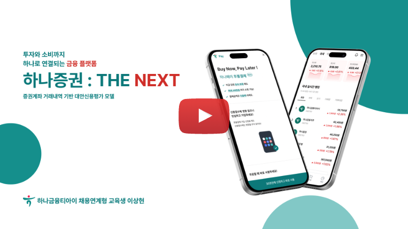
  </a>
  <p><i>▲ 클릭하시면 YouTube에서 프로젝트 광고 영상을 시청하실 수 있습니다.</i></p>
</div>
<br/>

하나증권 : THE NEXT는 증권계좌 거래내역 기반 대안신용평가 모델을 활용하여 투자와 소비를 하나로 연결한 통합 금융 플랫폼입니다. 최근 후불결제(BNPL) 서비스의 급격한 성장으로 연체율과 신용 리스크가 주요 문제로 떠오르고 있으며, 이를 해결하기 위해 투자 데이터를 기반으로 신용을 평가하고 후불결제 서비스에 적용하는 모델을 제안합니다.

<br/>

## 2. 주요 기능

| 국내주식 거래 | 해외주식 거래 | BNPL 후불결제 | 금 현물 투자 |
|:---:|:---:|:---:|:---:|
| 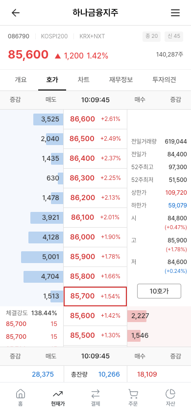 | 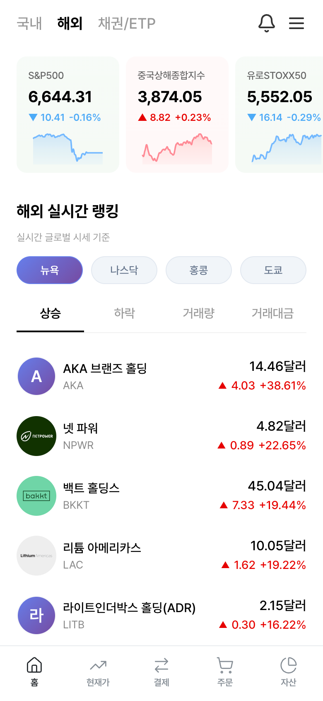 | 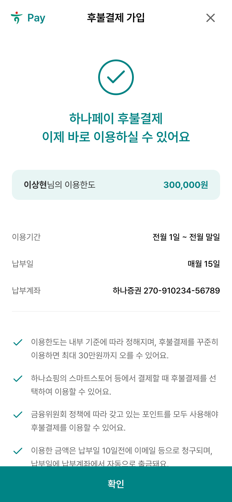 | 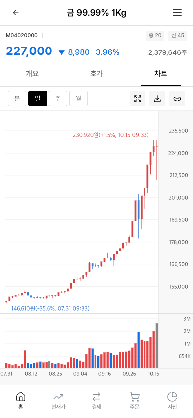 |
| 실시간 호가, 체결가<br/>분/일/주/월봉 차트<br/>재무정보 및 투자의견 | 미국/일본/중국/홍콩 거래<br/>실시간 글로벌 시세 | AI 대안신용평가 모델<br/>최대 30만원 한도<br/>투자내역 기반 심사 | 금 현물 실시간 시세<br/>1g 단위 소액투자<br/>미니금 종목 제공 |

| WebAuthn 지문인증 | 실시간 뉴스 | 내부 커머스 플랫폼 | 실시간 랭킹 |
|:---:|:---:|:---:|:---:|
| 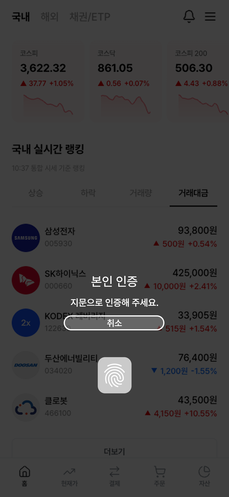 | 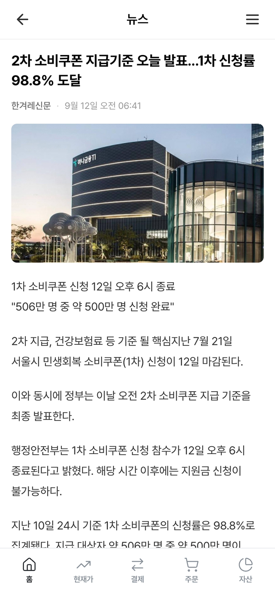 | 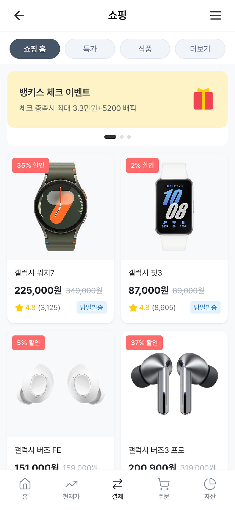 | 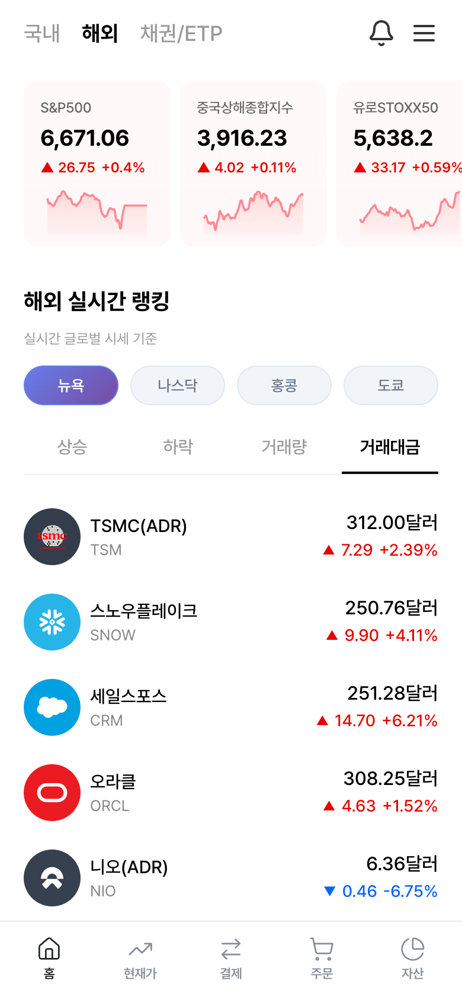 |
| FIDO2 표준 적용<br/>패스워드리스 생체인증<br/>안전한 로그인/회원가입 | 국내외 금융뉴스<br/>상세 뉴스 조회 | BNPL 결제 지원 | 국내외 종목 랭킹<br/>상승률/하락률 순위<br/>거래량/등락률 순위 |

<br/>

## 3. 후불결제 승인 과정

<div align="center">
  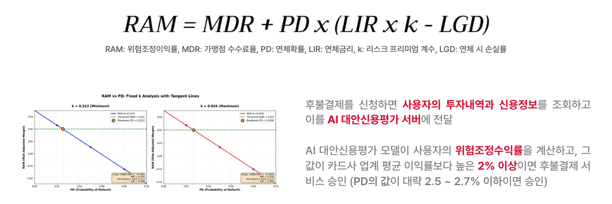
  <p><i>▲ 위험조정마진(RAM) 계산 공식 및 분석</i></p>
</div>

**RAM 공식:**
```
RAM = MDR + PD × (LIR × k - LGD)
```

- **RAM**: 위험조정이익률
- **MDR**: 가맹점 수수료
- **PD**: 연체확률 (AI 모델 예측)
- **LIR**: 연체금리
- **k**: 리스크 프리미엄 계수
- **LGD**: 연체 시 손실률

AI 대안신용평가 모델이 사용자의 **위험조정수익률**을 계산하고, 그 값이 카드사 업계 평균 이익률보다 높은 **2% 이상**이면 후불결제 서비스 승인 (PD의 값이 대략 2.5 ~ 2.7% 이하이면 승인)

## 4. 기술 스택

### 4-1. Frontend
<div>
  
  
  
</div>

### 4-2. Backend
<div>
  
  
  
  
  
  
</div>

### 4-3. Database
<div>
  
  
</div>

### 4-4. DevOps
<div>
  
  
  
</div>

<br/>

## 5. 서비스 아키텍처

### 5-1. 서비스 구성도

<div align="center">
  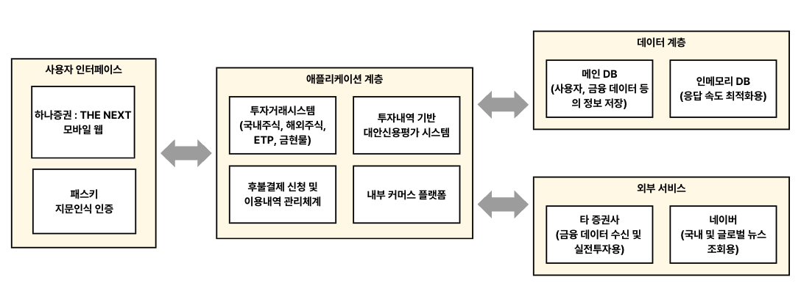
</div>

### 5-2. 시스템 구성도

<div align="center">
  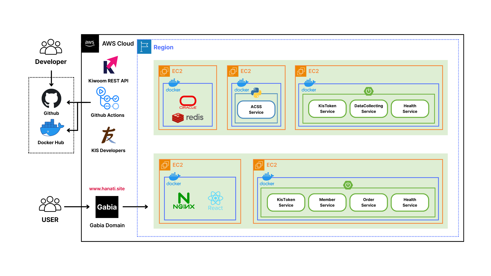
</div>

<br/>

## 6. 프로젝트 구조

```
HanaSecurities-TheNext/
├── HanaSecurities-TheNext-FE/     # Frontend (React + TypeScript)
├── HanaSecurities-TheNext-BE/     # Backend (Spring Boot + Java)
├── HanaSecurities-TheNext-AI/     # AI Server (Django + Python)
├── HanaSecurities-TheNext-DB/     # Database Schema (Oracle SQL)
├── assets/                        # 프로젝트 리소스 (이미지, 다이어그램)
├── 산출물/                        # 프로젝트 산출물 문서
└── README.md
```

각 폴더의 상세 구조는 해당 폴더의 README.md 파일을 참고해주세요.

<br/>

## 7. 디자인

프로젝트의 UI는 Figma에서 확인하실 수 있습니다.

- **Figma 링크**: [하나증권 : THE NEXT 디자인 보기](https://www.figma.com/design/mwIe1WUHzbtdbXqBR7ZmY8/%ED%95%98%EB%82%98%EC%A6%9D%EA%B6%8C---THE-NEXT?node-id=0-1&t=L15dglw3FgatGUZS-1)

<br/>

## 8. 개발자 프로필
|구분|내용|비고|
|:--:|:--:|:--:|
**이름**|이상현||
**연락처**|이메일|dltkdgus482@naver.com|
**전공**|수학|졸업(2023.02)|
**Skill set**|Language|Java, Python, Typescript
||Framework & Library|Spring Boot, React, Django|
||Database|Oracle, Redis|
||ETC|Git, AWS, Docker, Scikit-Learn|
|**자격증**|정보처리기사|2025.09.12|
||OPIc IH|2024.07.21|
|**수상**|폴리텍 벤처창업아이템 경진대회 본선진출(동상 확보)|한국폴리텍대학(2025.10.22)|
||삼성 청년 SW 아카데미 2학기 자율 프로젝트 우수상|삼성전자주식회사(2024.11.19)|
||삼성 청년 SW 아카데미 2학기 특화 프로젝트 우수상|삼성전자주식회사(2024.10.11)|
||삼성 청년 SW 아카데미 2학기 공통 프로젝트 우수상|삼성전자주식회사(2024.08.16)|
||삼성 청년 SW 아카데미 1학기 관통 프로젝트 우수상|삼성전자주식회사(2024.05.24)|
||삼성 청년 SW 아카데미 1학기 성적 우수상|삼성전자주식회사(2024.05.24)|
|**교육**|하나금융티아이 채용연계형 교육|2025.03 ~ 2025.10|
||서울핀테크아카데미(금융투자교육원) 금융투자업 트랙|2025.10 ~ 2025.12|
||삼성 청년 SW 아카데미(SSAFY)|2024.01 ~ 2024.12|
