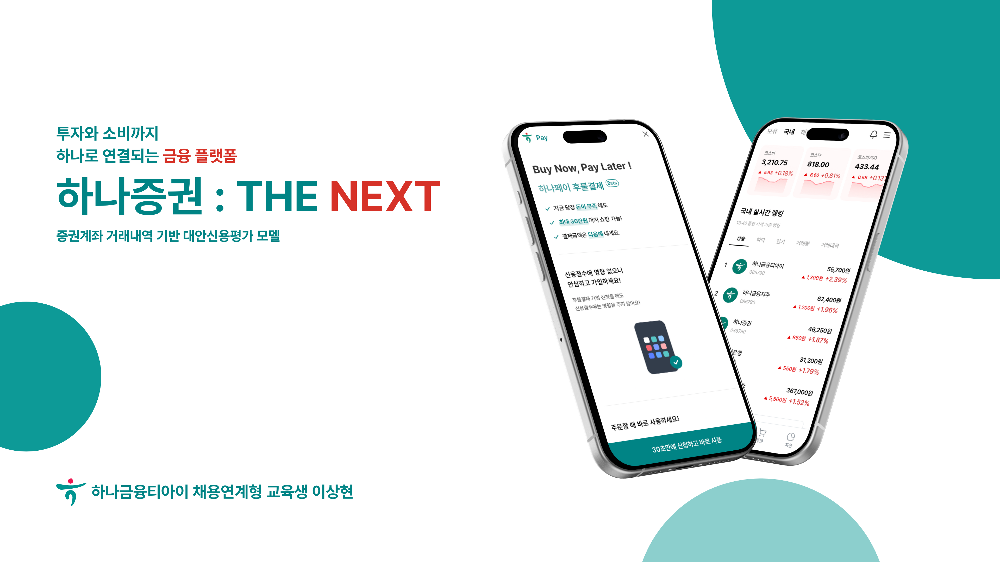

<h1>하나증권 : THE NEXT</h1>

<!-- 프로젝트 대표 이미지 -->
<div align="center">
  
</div>

<br/>

## 목차

1. [프로젝트 소개](#1-프로젝트-소개)
2. [주요 기능](#2-주요-기능)
3. [기술 스택](#3-기술-스택)
4. [프로젝트 구조](#4-프로젝트-구조)
5. [시작하기](#5-시작하기)
6. [개발 환경 설정](#6-개발-환경-설정)
7. [사용 방법](#7-사용-방법)
8. [연락처](#8-연락처)

<br/>

## 1. 프로젝트 소개

### 1-1. 프로젝트 목표

<br/>

## 2. 주요 기능

### 2-1. 핵심 기능

### 2-2. 차별화된 기능

<br/>

## 3. 기술 스택

### 3-1. Frontend
- **Framework**: React
- **Language**: TypeScript
- **Styling**: Vanilla CSS

### 3-2. Backend
- **Framework**: Spring Boot, Django
- **Language**: Java, Python
- **Authentication**: WebAuthn
- **API**: RESTful API / WebSocket

### 3-3. Database
- **Primary DB**: Oracle
- **Cache**: Redis

### 3-4. DevOps
- **Container**: Docker
- **CI/CD**: GitHub Actions
- **Cloud**: AWS EC2

<br/>

## 4. 프로젝트 구조

```
HanaSecurities-TheNext/
├── HanaSecurities-TheNext-FE/    # Frontend 애플리케이션
│   ├── src/
│   ├── public/
│   └── package.json
│
├── HanaSecurities-TheNext-BE/    # Backend 애플리케이션
│   ├── src/
│   ├── tests/
│   └── package.json
│
├── HanaSecurities-TheNext-DB/    # Database 스키마 및 마이그레이션
│   ├── migrations/
│   ├── seeds/
│   └── schema/
│
├── assets/                       # 프로젝트 문서 리소스 (이미지, 다이어그램 등)
│   └── images/
│
└── README.md
```

<br/>

## 5. 시작하기

### 5-1. 사전 요구사항

### 5-2. 설치

1. 레포지토리 클론

```bash
git clone https://github.com/dltkdgus482/HanaSecurities-TheNext.git
cd HanaSecurities-TheNext
```

2. Frontend 설정

```bash
cd HanaSecurities-TheNext-FE
yarn install
```

3. Backend 설정

4. Database 설정

<br/>

## 6. 개발 환경 설정

### 6-1. 환경 변수 설정

### 6-2. 개발 서버 실행

**Frontend**
```bash
cd HanaSecurities-TheNext-FE
yarn dev
```

<br/>

## 7. 사용 방법

1. 브라우저에서 `http://localhost:5173` 접속

<br/>

## 8. 연락처

프로젝트 관련 문의사항이 있으시면 언제든지 아래로 연락주세요!

- **Email**: dltkdgus482@naver.com
- **GitHub**: https://github.com/dltkdgus482