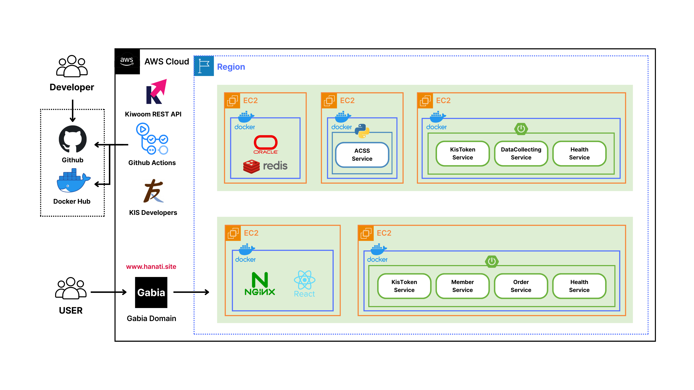

<h1>하나증권 : THE NEXT</h1>

<!-- 프로젝트 대표 이미지 -->
<div align="center">
  
</div>

<br/>

## 👋 하나증권 : THE NEXT 프로젝트의 저장소를 방문해주셔서 감사합니다!

> 안녕하세요! 하나증권 : THE NEXT 프로젝트 저장소에 오신 것을 환영합니다.
>
> 현재 코드와 산출물을 보완하는 중이며, 프로젝트 화면은 아래 목차의 [디자인](#6-디자인) 섹션에 있는 Figma 링크를 통해 확인하실 수 있습니다.
>
> 이 README를 통해 프로젝트의 전반적인 구조와 사용 방법을 확인하실 수 있습니다.
> 궁금한 점이나 개선 제안이 있으시다면 언제든지 [연락처](#10-연락처)로 연락 주세요!

<br/>

## 목차

1. [프로젝트 소개](#1-프로젝트-소개)
2. [주요 기능](#2-주요-기능)
3. [기술 스택](#3-기술-스택)
4. [서비스 아키텍처](#4-서비스-아키텍처)
5. [프로젝트 구조](#5-프로젝트-구조)
6. [디자인](#6-디자인)
7. [시작하기](#7-시작하기)
8. [개발 환경 설정](#8-개발-환경-설정)
9. [사용 방법](#9-사용-방법)
10. [연락처](#10-연락처)

<br/>

## 1. 프로젝트 소개

### 1-1. 프로젝트 목표

<br/>

## 2. 주요 기능

### 2-1. 핵심 기능

### 2-2. 차별화된 기능

<br/>

## 3. 기술 스택

### 3-1. Frontend
<div>
  
  
  
</div>

### 3-2. Backend
<div>
  
  
  
  
  
  
</div>

### 3-3. Database
<div>
  
  
</div>

### 3-4. DevOps
<div>
  
  
  
</div>

<br/>

## 4. 서비스 아키텍처

### 4-1. 시스템 구성도

<div align="center">
  
</div>

시스템은 크게 Frontend, Backend, Database 계층으로 구성되어 있으며, 각 계층은 다음과 같은 역할을 수행합니다:

- **Frontend Layer**: React 기반의 SPA(Single Page Application)로 사용자 인터페이스 제공
- **Backend Layer**: Spring Boot와 Django를 활용한 RESTful API 및 WebSocket 통신
- **Database Layer**: Oracle을 주 데이터베이스로, Redis를 캐싱 레이어로 활용
- **DevOps**: Docker 컨테이너화 및 AWS EC2 기반 배포, GitHub Actions를 통한 CI/CD 자동화

<br/>

## 5. 프로젝트 구조

```
HanaSecurities-TheNext/
├── HanaSecurities-TheNext-FE/    # Frontend 애플리케이션
│   ├── src/
│   ├── public/
│   └── package.json
│
├── HanaSecurities-TheNext-BE/    # Backend 애플리케이션
│   ├── src/
│   ├── tests/
│   └── package.json
│
├── HanaSecurities-TheNext-DB/    # Database 스키마 및 마이그레이션
│   ├── migrations/
│   ├── seeds/
│   └── schema/
│
├── assets/                       # 프로젝트 문서 리소스 (이미지, 다이어그램 등)
│   └── images/
│
└── README.md
```

<br/>

## 6. 디자인

### 6-1. Figma
프로젝트의 UI/UX 디자인은 Figma에서 확인하실 수 있습니다.

- **Figma 링크**: [하나증권 : THE NEXT 디자인 보기](https://www.figma.com/design/mwIe1WUHzbtdbXqBR7ZmY8/%ED%95%98%EB%82%98%EC%A6%9D%EA%B6%8C---THE-NEXT?node-id=0-1&t=L15dglw3FgatGUZS-1)

<br/>

## 7. 시작하기

### 7-1. 사전 요구사항

### 7-2. 설치

1. 레포지토리 클론

```bash
git clone https://github.com/dltkdgus482/HanaSecurities-TheNext.git
cd HanaSecurities-TheNext
```

2. Frontend 설정

```bash
cd HanaSecurities-TheNext-FE
yarn install
```

3. Backend 설정

4. Database 설정

<br/>

## 8. 개발 환경 설정

### 8-1. 환경 변수 설정

### 8-2. 개발 서버 실행

**Frontend**
```bash
cd HanaSecurities-TheNext-FE
yarn dev
```

<br/>

## 9. 사용 방법

1. 브라우저에서 `http://localhost:5173` 접속

<br/>

## 10. 연락처

프로젝트 관련 문의사항이 있으시면 언제든지 아래로 연락주세요!

- **Email**: dltkdgus482@naver.com
- **GitHub**: https://github.com/dltkdgus482